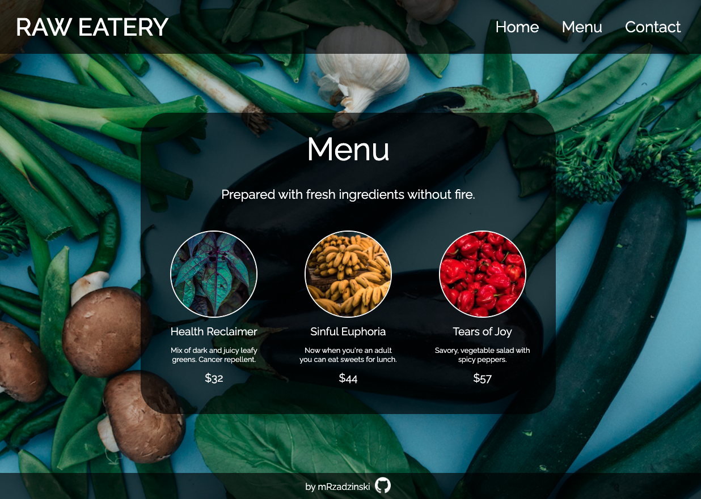

# Restaurant Page

[Check live](https://mrzadzinski.github.io/restaurant-page/)

Simple restaurant website with content rendered in JavaScript

## Technologies
* Webpack
* Npm
* JavaScript
* SASS
* HTML

## Skills practiced
* Webpack
    * Basic setup
    * Importing CSS, SCSS, images
    * Watch and clean options
    * HtmlWebpackPlugin
* Npm package installation 
* Importing and exporting data between JavaScript modules

## Acknowledgments
This project was an assignment from The Odin Project course:

[Restaurant Page](https://www.theodinproject.com/lessons/node-path-javascript-restaurant-page) project.

